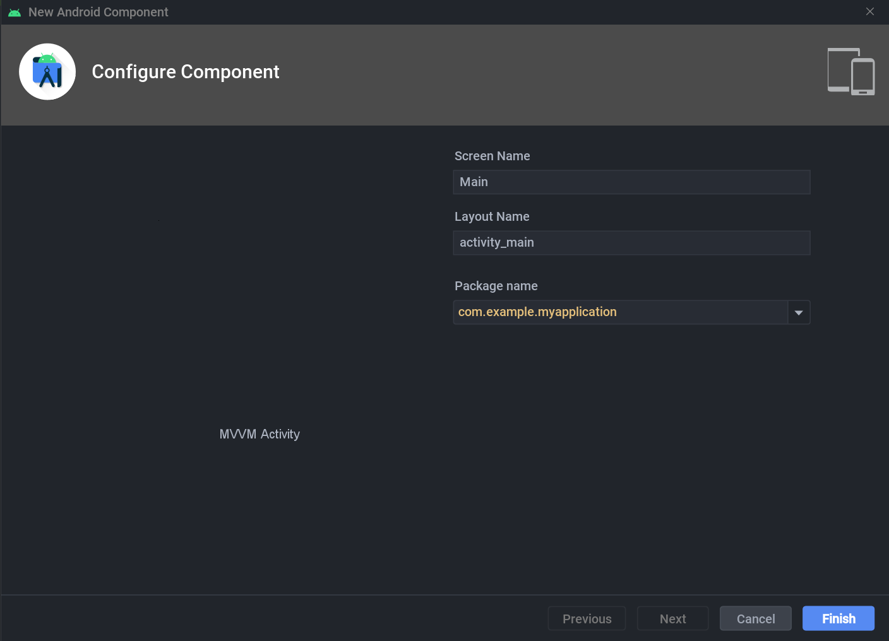

# android-template-plugin


<!-- [](https://plugins.jetbrains.com/plugin/PLUGIN_ID)
[](https://plugins.jetbrains.com/plugin/PLUGIN_ID) -->

## Supported Templates

- MVVM Activity (New > Other > MVVM Activity)
  - Wizard Preview
    
  - Activity
    ```kotlin
    import androidx.appcompat.app.AppCompatActivity
    import android.os.Bundle

    class ${screenName}Activity : AppCompatActivity() {
        private val viewModel: ViewModel by viewModels()

        override fun onCreate(savedInstanceState: Bundle?) {
            super.onCreate(savedInstanceState)
        }

        override fun onStart() {
            super.onStart()
            viewModel.uiState.observe(this) {
            }
        }
    }
    ```
  - UiState (Data Class)
    ```kotlin
    data class ${screenName}UiState(val data: String = "")
    ```
  - ViewModel
    ```kotlin
    import androidx.lifecycle.LiveData
    import androidx.lifecycle.MutableLiveData
    import androidx.lifecycle.ViewModel

    class ${screenName}ViewModel : ViewModel() {
        private val _uiState = MutableLiveData(${screenName}UiState())
        val uiState: LiveData<${screenName}UiState> = _uiState
    }
    ```

## Installation

- Using IDE built-in plugin system:
  
  <kbd>Settings/Preferences</kbd> > <kbd>Plugins</kbd> > <kbd>Marketplace</kbd> > <kbd>Search for "android-template-plugin"</kbd> >
  <kbd>Install Plugin</kbd>
  
- Manually:

  Download the [latest release](https://github.com/namhyun-gu/android-template-plugin/releases/latest) and install it manually using
  <kbd>Settings/Preferences</kbd> > <kbd>Plugins</kbd> > <kbd>⚙️</kbd> > <kbd>Install plugin from disk...</kbd>


---
Plugin based on the [IntelliJ Platform Plugin Template][template].

[template]: https://github.com/JetBrains/intellij-platform-plugin-template
